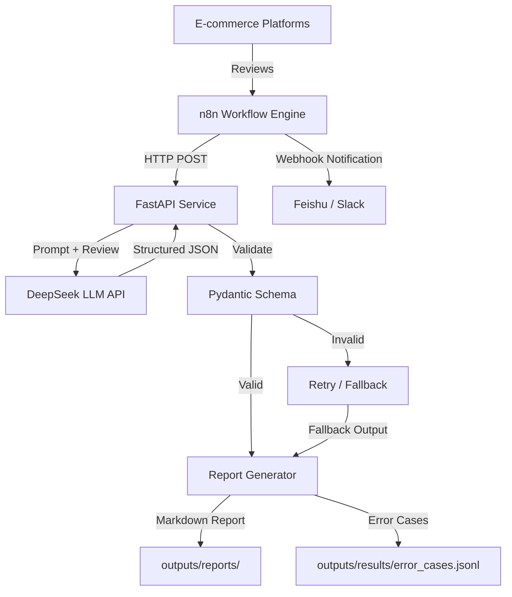
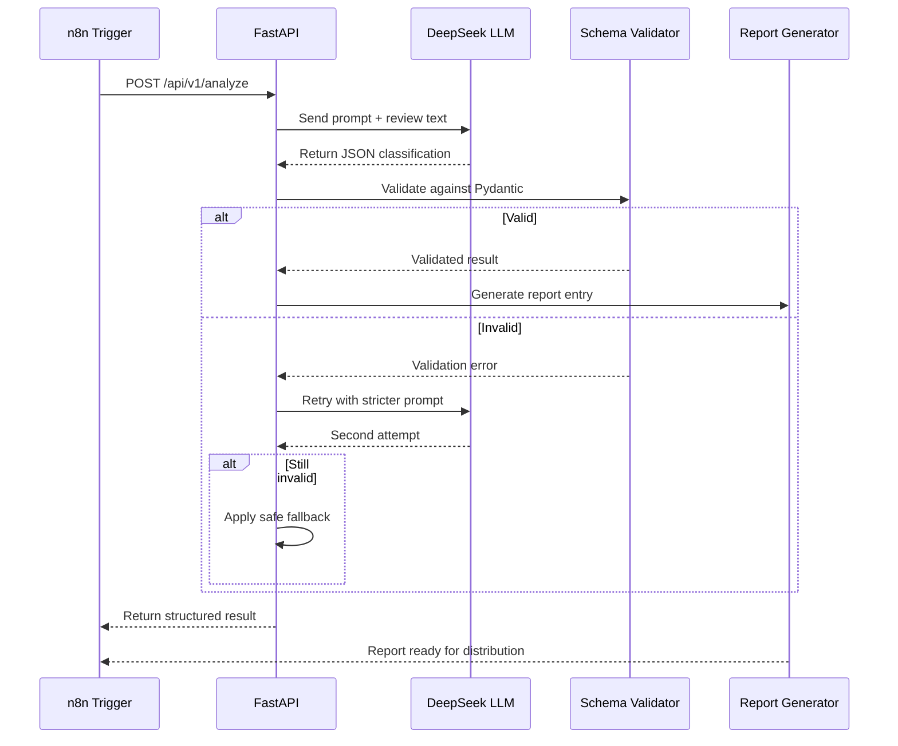

# Architecture Overview

## System Architecture

## Component Overview

### 1. FastAPI Service (`src/review_agent/api.py`)

The central AI analysis service. Exposes RESTful endpoints for review classification.

**Endpoints:**

| Method | Path | Description | Status |
|--------|------|-------------|--------|
| GET | `/api/v1/health` | Service health check | ✅ M1 |
| POST | `/api/v1/analyze` | Analyze a single review | ⬜ M3 |
| POST | `/api/v1/analyze_batch` | Analyze multiple reviews | ⬜ M3 |

### 2. LLM Client (`src/review_agent/llm_client.py`)

Abstraction layer for calling the DeepSeek API. Handles:
- Prompt construction with few-shot examples
- API call with retry logic
- Response parsing and JSON extraction

### 3. Schema Layer (`src/review_agent/schemas.py`)

Pydantic models for input/output validation:
- `ReviewInput` — validates incoming review data
- `ReviewOutput` — validates LLM classification output
- `AnalyzeRequest` / `AnalyzeResponse` — API request/response models

### 4. Workflow Orchestrator (`src/review_agent/workflow.py`)

Coordinates the end-to-end analysis pipeline:
1. Read reviews → 2. Call LLM → 3. Validate output → 4. Detect contradictions → 5. Flag for human review

### 5. Report Generator (`src/review_agent/report.py`)

Generates markdown reports and summary statistics from analyzed results.
Distinguishes confirmed results from uncertain cases.

### 6. n8n Workflow Engine

Orchestrates business automation:
- Scheduled triggers: hourly/daily review fetch
- HTTP Request node: calls FastAPI endpoints
- Code nodes: data transformation and aggregation
- Webhook/Feishu nodes: notifications and alerts

### 7. Guardrails

- JSON parse with retry (max 2 attempts)
- Pydantic schema validation
- Confidence threshold filtering
- Contradiction detection (low rating + non-negative sentiment)
- Safe fallback for unparseable outputs
- Error logging to `outputs/results/error_cases.jsonl`

## Data Flow

## Technology Decisions

| Decision | Rationale |
|----------|-----------|
| DeepSeek (not GPT-4) | Cost-effective for high-volume classification; strong JSON output |
| FastAPI (not Flask) | Native async support, automatic OpenAPI docs, Pydantic integration |
| n8n (not Dify/Coze) | Self-hosted, code-node flexibility, better for business workflow automation |
| Pydantic v2 | Strict schema validation, better error messages, faster than v1 |
| Markdown reports | Human-readable, version-control friendly, easy to send via Feishu |
