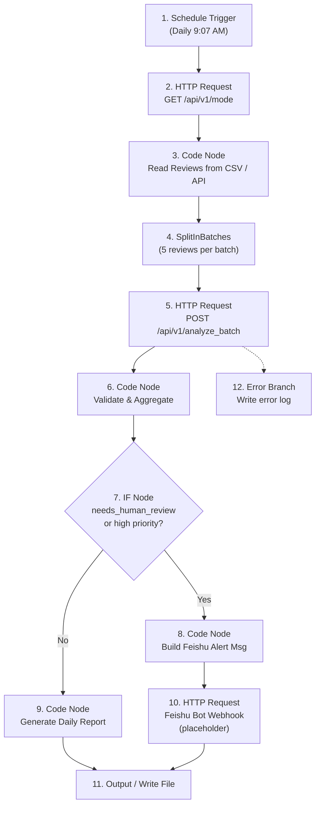
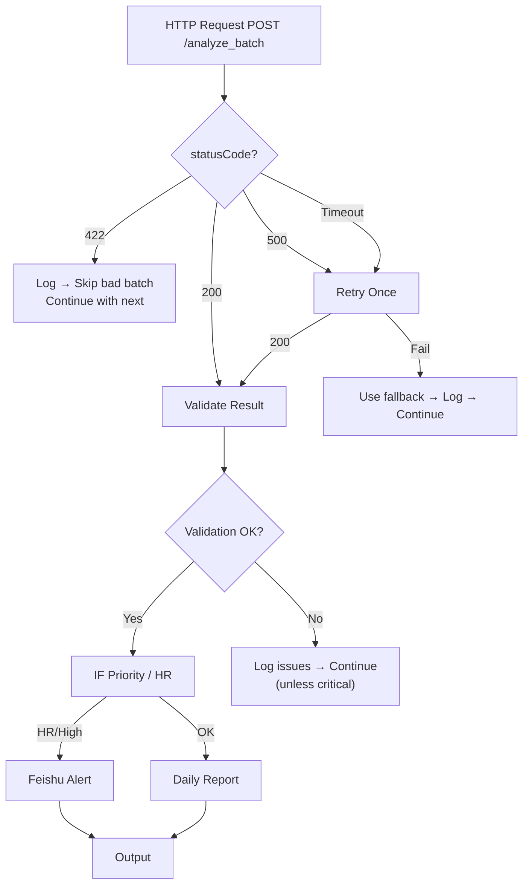

# n8n Workflow Design — Production Edition

> Cross-border e-commerce review monitoring and automatic classification — n8n workflow documentation.
> V2-M4: Production-grade workflow with IF routing, validate node, batch processing, Feishu notification, and error handling.

---

## 1. Workflow Goal

This n8n workflow automates the **cross-border e-commerce review monitoring and classification** pipeline from data ingestion to team notification.

### Business Objectives

| # | Objective | How |
|---|-----------|-----|
| 1 | **Read review data** | Read from CSV / API / database (production replaceable) |
| 2 | **Split into batches** | SplitInBatches for large datasets |
| 3 | **Call AI analysis service** | HTTP Request → FastAPI `POST /api/v1/analyze_batch` |
| 4 | **Validate results** | Code Node validates response structure and field completeness |
| 5 | **Route by priority/confidence** | IF nodes route high-priority / low-confidence to separate paths |
| 6 | **Generate daily report** | Code Node computes statistics and formats a Markdown report |
| 7 | **Notify operations team** | Feishu bot webhook (placeholder) for urgent items |
| 8 | **Extend to real platforms** | (Future) Amazon SP-API, Shopify Admin API, Feishu Base |

---

## 2. Prerequisites

### 2.1 Start the FastAPI Service

```bash
conda activate ecommerce-agent
cd /root/autodl-tmp/ecommerce-review-agent

# Real mode — requires DEEPSEEK_API_KEY in .env
uvicorn src.review_agent.api:app --host 0.0.0.0 --port 8000 --reload

# Mock mode — for offline demo / testing
USE_MOCK_LLM=true uvicorn src.review_agent.api:app --host 0.0.0.0 --port 8000 --reload
```

### 2.2 Verify the Service

```bash
# Health check
curl http://127.0.0.1:8000/api/v1/health

# Mode check (NEW V2-M4)
curl http://127.0.0.1:8000/api/v1/mode
```

### 2.3 Mode Endpoint Response (V2-M4)

```
GET http://127.0.0.1:8000/api/v1/mode
```

```json
{
  "service": "ecommerce-review-agent",
  "use_mock_llm": false,
  "llm_mode": "real",
  "model": "deepseek-v4-pro",
  "base_url": "https://api.deepseek.com",
  "api_key_configured": true
}
```

> **n8n integration note**: Call `/api/v1/mode` at workflow start. If `llm_mode` is `"mock"` and `api_key_configured` is `false`, the workflow should notify that results are for testing only.

### 2.4 n8n Environment Setup

```bash
conda activate ecommerce-agent
cd /root/autodl-tmp/ecommerce-review-agent

export N8N_USER_FOLDER=/root/autodl-tmp/ecommerce-review-agent/.n8n
export N8N_HOST=0.0.0.0
export N8N_PORT=5678
export N8N_LISTEN_ADDRESS=0.0.0.0
export N8N_PROTOCOL=http
export N8N_SECURE_COOKIE=false

n8n start
```

---

## 3. Recommended Production Workflow

### 3.1 Flow Diagram (Mermaid)



### 3.2 Production Node List (12 nodes)

| # | Node Name | Node Type | Required | Phase |
|---|-----------|-----------|----------|-------|
| 1 | Schedule Trigger | `n8n-nodes-base.scheduleTrigger` | Production | Trigger |
| 2 | Check Service Mode | `n8n-nodes-base.httpRequest` (GET /api/v1/mode) | ✅ | Pre-flight |
| 3 | Read Reviews Source | `n8n-nodes-base.code` (JavaScript) | ✅ | Data |
| 4 | Split In Batches | `n8n-nodes-base.splitInBatches` | ✅ | Batching |
| 5 | Call Analyze Batch API | `n8n-nodes-base.httpRequest` (POST /api/v1/analyze_batch) | ✅ | AI |
| 6 | Validate Result | `n8n-nodes-base.code` (JavaScript) | ✅ | Quality |
| 7 | IF Human Review / High Priority | `n8n-nodes-base.if` | ✅ | Routing |
| 8 | Build Feishu Alert Message | `n8n-nodes-base.code` (JavaScript) | ✅ | Alert |
| 9 | Generate Daily Report | `n8n-nodes-base.code` (JavaScript) | ✅ | Report |
| 10 | Send Feishu Bot | `n8n-nodes-base.httpRequest` (POST webhook) | Placeholder | Notify |
| 11 | Output / Write Report | `n8n-nodes-base.code` or `n8n-nodes-base.writeFile` | ✅ | Output |
| 12 | Error Branch | `n8n-nodes-base.code` + IF routing | ✅ | Resilience |

---

## 4. Each Node's Role

### 4.1 Schedule Trigger

| Property | Value |
|----------|-------|
| **Node Type** | `n8n-nodes-base.scheduleTrigger` |
| **Cron** | `7 9 * * 1-5` (9:07 AM, Mon–Fri) |
| **Input** | None |
| **Output** | `{ timestamp: "..." }` |
| **Interview Point** | "This replaces the Manual Trigger in production. It runs every weekday at 9:07 AM — the 7-minute offset avoids the :00 rush hour of cron jobs. For MVP demos, use Manual Trigger instead." |

### 4.2 HTTP Request: Check Service Mode (GET /api/v1/mode)

| Property | Value |
|----------|-------|
| **Node Type** | `n8n-nodes-base.httpRequest` |
| **Method** | GET |
| **URL** | `http://127.0.0.1:8000/api/v1/mode` |
| **Timeout** | 10 seconds |
| **Interview Point** | "Before processing any data, we check what mode the service is in. If it's mock mode, we tag the report accordingly. In production, this can also trigger an alert if the API key is missing or the model configuration has changed." |

### 4.3 Code Node: Read Reviews Source

| Property | Value |
|----------|-------|
| **Node Type** | `n8n-nodes-base.code` |
| **Language** | JavaScript |
| **Mode** | "Run Once for All Items" |
| **Interview Point** | "This node abstracts data ingestion. In production, replace with HTTP Request to Amazon SP-API, database query, or CSV file read. The downstream nodes don't care where data comes from — they just expect an array of review objects matching the ReviewInput schema." |

### 4.4 Split In Batches

| Property | Value |
|----------|-------|
| **Node Type** | `n8n-nodes-base.splitInBatches` |
| **Batch Size** | 5 |
| **Options** | Reset: false |
| **Interview Point** | "For datasets larger than a few reviews, batching prevents timeout and gives you per-batch visibility. If one batch fails, the others still process. This is a key production pattern — you don't want 50 reviews to fail because of one problem." |

### 4.5 HTTP Request: Call Analyze Batch API (POST /api/v1/analyze_batch)

| Property | Value |
|----------|-------|
| **Node Type** | `n8n-nodes-base.httpRequest` |
| **Method** | POST |
| **URL** | `http://127.0.0.1:8000/api/v1/analyze_batch` |
| **Headers** | `Content-Type: application/json` |
| **Body Format** | JSON |
| **Body** | `={ "reviews": $json.reviews }` |
| **Timeout** | 120 seconds |
| **Retry** | 1 retry on failure |
| **Interview Point** | "This is the core AI integration point. n8n sends a batch of reviews to FastAPI, which calls DeepSeek V4 Pro, validates with Pydantic, applies guardrails, and returns structured results. n8n never holds the DeepSeek API key — the FastAPI service handles authentication." |

### 4.6 Code Node: Validate Result

| Property | Value |
|----------|-------|
| **Node Type** | `n8n-nodes-base.code` |
| **Language** | JavaScript |
| **Interview Point** | "This is the quality gate. We validate that the batch response has all required fields, that counts match, and that each result includes evidence, sentiment, and llm_mode. Failed validations route to the error branch." |

**Validation checks:**

```javascript
// For the batch response, check:
// 1. results array exists and has correct length
// 2. total == results.length
// 3. Each result has: sentiment, issue_category, priority, evidence, llm_mode
// 4. real_count + mock_count >= total - error_count
// 5. If llm_mode == 'mock', flag for attention (not production data)
```

### 4.7 IF Node: Human Review / High Priority

| Property | Value |
|----------|-------|
| **Node Type** | `n8n-nodes-base.if` |
| **Conditions** | See below |
| **True branch** | → Build Feishu Alert Message |
| **False branch** | → Generate Daily Report |
| **Interview Point** | "The IF node routes results to different downstream paths. Urgent items go to the alert path for immediate notification. Routine results go to the daily report path. This is the bridge between AI analysis and business action." |

**Routing conditions:**

```
Condition 1: $json.needs_human_review == true
Condition 2: $json.priority == high
Condition 3: $json.confidence < 0.6
Condition 4: $json.issue_category == other AND $json.confidence < 0.7
Condition 5: $json.is_mock == true  → warn: "Results are mock — not for business decisions"
```

### 4.8 Code Node: Build Feishu Alert Message

| Property | Value |
|----------|-------|
| **Node Type** | `n8n-nodes-base.code` |
| **Language** | JavaScript |
| **Interview Point** | "High-priority items need immediate attention. This node formats them into a Feishu message card with review ID, issue category, Chinese summary, and suggested action. In production, this card drops into the operations team's Feishu group chat within seconds of detection." |

### 4.9 Code Node: Generate Daily Report

| Property | Value |
|----------|-------|
| **Node Type** | `n8n-nodes-base.code` |
| **Language** | JavaScript |
| **Interview Point** | "Standard reviews that don't need urgent attention are collected into a daily report. This mirrors what the Python `report.py` generates — but in n8n JavaScript, giving the operations team a self-contained view of the day's review landscape." |

### 4.10 HTTP Request: Send Feishu Bot (Placeholder)

| Property | Value |
|----------|-------|
| **Node Type** | `n8n-nodes-base.httpRequest` |
| **Method** | POST |
| **URL** | `YOUR_FEISHU_WEBHOOK_URL` |
| **Headers** | `Content-Type: application/json` |
| **Body** | Formatted Feishu message card from previous node |
| **Interview Point** | "The webhook URL is a placeholder — in production, replace with your actual Feishu bot webhook. The message card format follows Feishu's interactive message spec. If the webhook fails, the workflow doesn't crash — the report is still written locally." |

### 4.11 Output / Write Report

| Property | Value |
|----------|-------|
| **Node Type** | `n8n-nodes-base.code` or `n8n-nodes-base.noOp` |
| **Interview Point** | "Terminal node. In production, replace with Feishu Base API write, database insert, or file output. The NoOp lets you inspect the final output during development." |

### 4.12 Error Branch

| Property | Value |
|----------|-------|
| **Node Type** | IF after HTTP Request → Code Node |
| **Conditions** | `statusCode != 200` OR `$json.error_count > 0` |
| **Interview Point** | "Errors are not ignored. The error branch logs failures, retries where appropriate, and notifies if error rate exceeds threshold. This is the difference between a demo and a production system." |

---

## 5. FastAPI Endpoint Reference for n8n

### 5.1 Recommended Endpoint for Batch Operations

```
POST http://127.0.0.1:8000/api/v1/analyze_batch
```

**Why batch over single**: One HTTP call processes multiple reviews, reducing n8n round-trips and giving you aggregate statistics (`total`, `real_count`, `mock_count`, `error_count`, `needs_human_review_count`) in a single response.

### 5.2 Batch Request Body

```json
{
  "reviews": [
    {
      "review_id": "r001",
      "platform": "Amazon",
      "product_name": "Wireless Security Camera",
      "rating": 2,
      "review_text": "Battery drains too fast and the night vision is blurry.",
      "country": "US",
      "created_at": "2026-06-01"
    }
  ]
}
```

### 5.3 Batch Response Body (V2-M4)

```json
{
  "total": 3,
  "needs_human_review_count": 1,
  "error_count": 0,
  "real_count": 3,
  "mock_count": 0,
  "results": [
    {
      "review_id": "r001",
      "sentiment": "negative",
      "issue_category": "battery",
      "priority": "high",
      "responsible_team": "product",
      "summary_zh": "客户反馈电池耗电过快...",
      "suggested_action_zh": "建议产品团队检查电池表现...",
      "confidence": 0.95,
      "needs_human_review": false,
      "evidence": ["Battery drains too fast", "night vision is blurry"],
      "llm_mode": "real",
      "is_mock": false,
      "model": "deepseek-v4-pro",
      "processing_time_ms": 15234.5
    }
  ]
}
```

### 5.4 Response Field Reference (Full V2 Schema)

| Field | Type | Description |
|-------|------|-------------|
| `review_id` | string | Echoed from input |
| `sentiment` | string | `positive`, `neutral`, or `negative` (strict enum) |
| `issue_category` | string | One of 8 categories (strict enum) |
| `priority` | string | `high`, `medium`, or `low` (strict enum) |
| `responsible_team` | string | One of 6 teams (strict enum) |
| `summary_zh` | string | Chinese summary of the review issue |
| `suggested_action_zh` | string | Suggested action in Chinese |
| `confidence` | float | 0.0–1.0 |
| `needs_human_review` | bool | `true` when guardrails triggered |
| `evidence` | list[str] | Verbatim phrases from review_text (V2-M1) |
| `llm_mode` | string | `"real"` or `"mock"` (V2-M1) |
| `is_mock` | bool | `true` when mock mode (V2-M1) |
| `model` | string | Model identifier (V2-M1) |
| `processing_time_ms` | float\|null | API call duration (V2-M2) |

### 5.5 Single Review Endpoint (Alternative)

```
POST http://127.0.0.1:8000/api/v1/analyze
```

Use for single-review processing or testing. Same response fields as batch results (without the batch wrapper).

### 5.6 Mode Endpoint (NEW V2-M4)

```
GET http://127.0.0.1:8000/api/v1/mode
```

Returns current service configuration — whether LLM is real or mock, which model is configured, whether API key is present.

---

## 6. Validate Result Node — Detailed Specification

The Validate node is critical for production reliability. Here's what it should check:

```javascript
// ── Validate Batch Analysis Response ────────────────────────────────
const batch = $input.first().json;

const issues = [];

// Check 1: results array exists
if (!Array.isArray(batch.results)) {
  issues.push("results is not an array");
}

// Check 2: total matches results length
if (batch.total !== batch.results.length) {
  issues.push(`total (${batch.total}) != results.length (${batch.results.length})`);
}

// Check 3: each result has required fields
const requiredFields = [
  "review_id", "sentiment", "issue_category", "priority",
  "confidence", "needs_human_review", "evidence", "llm_mode"
];
for (const [i, r] of batch.results.entries()) {
  for (const field of requiredFields) {
    if (!(field in r)) {
      issues.push(`results[${i}].${field} missing`);
    }
  }
}

// Check 4: llm_mode consistency with is_mock
for (const r of batch.results) {
  if (r.llm_mode === "mock" && r.is_mock !== true) {
    issues.push(`${r.review_id}: llm_mode=mock but is_mock!=true`);
  }
  if (r.llm_mode === "real" && r.is_mock !== false) {
    issues.push(`${r.review_id}: llm_mode=real but is_mock!=false`);
  }
}

// Check 5: mock mode warning
const mockResults = batch.results.filter(r => r.llm_mode === "mock");
if (mockResults.length > 0) {
  issues.push(`WARNING: ${mockResults.length} results are mock — not for business decisions`);
}

// Check 6: error count check
if (batch.error_count > 0) {
  issues.push(`ERROR: ${batch.error_count} reviews had errors (API/parse/validation)`);
}

// Output
return [{
  json: {
    ...batch,
    _validation: {
      passed: issues.length === 0 || issues.every(i => i.startsWith("WARNING")),
      issue_count: issues.length,
      issues: issues
    }
  }
}];
```

---

## 7. IF Node Logic — Detailed Conditions

### 7.1 Human Review Routing

| Condition | Expression | Route To |
|-----------|-----------|----------|
| Needs human review | `$json.needs_human_review == true` | Feishu Alert |
| High priority | `$json.priority == "high"` | Feishu Alert |
| Very low confidence | `$json.confidence < 0.6` | Feishu Alert |
| Uncategorized low rating | `$json.issue_category == "other" && $json.confidence < 0.7` | Feishu Alert |
| None of the above | — | Daily Report |

### 7.2 Error Routing

| Condition | Expression | Action |
|-----------|-----------|--------|
| HTTP status ≠ 200 | `$json.statusCode != 200` | Error branch → log → retry or skip |
| Validation failed | `$json._validation?.passed == false` | Error branch → log → inspect |
| Batch has errors | `$json.error_count > 0` | Warn but continue (some results may be valid) |

---

## 8. Feishu Message Template

**Placeholder URL**: `YOUR_FEISHU_WEBHOOK_URL` (replace with actual webhook in production)

### Interactive Card Format

```javascript
// ── Build Feishu Alert Message Card ──────────────────────────────────
const item = $input.first().json;

const card = {
  msg_type: "interactive",
  card: {
    header: {
      title: { content: "⚠️ 评论分析需人工关注", tag: "plain_text" },
      template: "red"
    },
    elements: [
      {
        tag: "div",
        text: {
          tag: "lark_md",
          content: [
            `**Review ID**: ${item.review_id}`,
            `**平台**: ${item.platform || "?"}`,
            `**产品**: ${item.product_name || "?"}`,
            `**评分**: ${item.rating || "?"} 星`,
            `**情绪**: ${item.sentiment}`,
            `**问题类别**: ${item.issue_category}`,
            `**优先级**: ${item.priority}`,
            `**置信度**: ${(item.confidence * 100).toFixed(0)}%`,
            `**责任团队**: ${item.responsible_team}`,
            ``,
            `**摘要**: ${item.summary_zh}`,
            `**建议动作**: ${item.suggested_action_zh}`,
            `**证据**: ${(item.evidence || []).join("; ") || "(无)"}`
          ].join("\\n")
        }
      },
      { tag: "hr" },
      {
        tag: "note",
        elements: [
          {
            tag: "plain_text",
            content: `模式: ${item.llm_mode} | 模型: ${item.model} | ${new Date().toISOString()}`
          }
        ]
      }
    ]
  }
};

return [{ json: card }];
```

> **Security note**: This template uses placeholder URL `YOUR_FEISHU_WEBHOOK_URL`. Replace with your actual Feishu bot webhook in production. Never commit real webhook URLs to Git.

---

## 9. Error Handling Strategy

### 9.1 Failure Mode Matrix

| # | Failure | Symptom | n8n Action |
|---|---------|---------|------------|
| 1 | FastAPI not started | ECONNREFUSED | Check mode node fails → alert → stop |
| 2 | HTTP timeout | Request > 120s | Retry once → if still fails, log to error branch |
| 3 | API 422 (bad input) | statusCode=422 | Log bad input → skip → continue |
| 4 | API 500 (server error) | statusCode=500 | Retry once → fallback → log |
| 5 | DeepSeek API failure | error_count > 0 in response | Log → fallback results used → continue |
| 6 | JSON parse failure | _validation issues | Retry within FastAPI → if still fails, fallback |
| 7 | Split batch partial failure | Some batches fail | Error branch per batch → successful batches continue |
| 8 | Feishu webhook down | Non-200 from webhook | Skip notification → report still written locally |
| 9 | Duplicate execution | Same review_id twice | review_id dedup in report aggregation |
| 10 | Mock mode results | is_mock=true in response | WARNING tag in report → do NOT use for business decisions |

### 9.2 Error Routing Diagram



### 9.3 Production Error Handling Principles

1. **Never fail silently**: Every error path produces a log or notification.
2. **Retry with backoff**: Transient failures (network, timeout, 5xx) are retried once. Permanent failures (4xx) are not.
3. **Batch isolation**: One failing batch does not kill the entire run.
4. **Mock-mode awareness**: Results produced in mock mode are clearly marked and should not be used for business decisions.
5. **API key safety**: n8n never holds the DeepSeek API key. The FastAPI service handles authentication internally.
6. **Graceful degradation**: If Feishu is down, the report is still saved locally.

---

## 10. idempotency Strategy

### 10.1 review_id Deduplication

n8n Code Node should track processed `review_id`s within a single run:

```javascript
// Within the Run Once for All Items context:
const seen = new Set();
const dedupedResults = allResults.filter(r => {
  if (seen.has(r.review_id)) return false;
  seen.add(r.review_id);
  return true;
});
```

### 10.2 Production idempotency

- Store processed `review_id`s in a database or Feishu Base with a `processed_at` timestamp.
- Before calling FastAPI, check if `review_id` was already analyzed today.
- Schedule Trigger with Cron should use a time window (e.g., "last 24 hours") to avoid re-processing.

---

## 11. Interview Talking Points — 2-Minute Script (中文)

> Use this script to explain the production n8n workflow in an interview.

---

"这个 n8n 工作流展示了**如何把 AI 分析能力以生产级标准接入业务自动化流程**。"

"整个流程分四个阶段：**第一，预检**——通过 GET /api/v1/mode 检查 FastAPI 服务状态，确认是真实 DeepSeek 模式还是 Mock 模式，确认 API key 是否配置。如果服务不可用，工作流在这里就停下来并告警，不让后续节点空跑。"

"**第二，批量处理**——不是一条一条发 HTTP 请求，而是用 SplitInBatches 把数据分批，每批 5 条，一次性发给 POST /api/v1/analyze_batch。这样做的好处是减少 n8n 和 FastAPI 之间的往返次数，同时保持单批粒度——一批失败不影响其他批。"

"**第三，质量校验和路由**——每批返回后用一个 Code Node 做校验：results 数组长度对不对？required fields 全不全？llm_mode 和 is_mock 是否一致？校验通过后，用 IF 节点路由：高优先级和人工复核的评论走飞书告警路径，常规评论走日报报告路径。Mock 模式的结果会特别标注——不进入正式业务决策。"

"**第四，通知和输出**——飞书告警消息是一个交互式卡片，包含 review_id、问题类别、中文摘要、建议动作、证据片段，运营团队在群里直接看到需要关注的内容。日报报告汇总整体数据：总评论数、各类别分布、团队工作量分布。"

"**为什么用 n8n 而不是自己写 Python 脚本编排**？两个原因：第一，n8n 天然支持错误路由——IF 节点可以基于 statusCode、confidence、needs_human_review 等字段动态分支，写 Python 脚本要做很多 try/except 和 if/else；第二，n8n 的 Schedule Trigger、SplitInBatches、HTTP Request 重试是内置的——不用自己实现 cron、batching、retry。**编排用 n8n，AI 智能在 FastAPI 里，分工明确。**"

"**关键安全设计**：n8n 不持有 DeepSeek API key。工作流只调 FastAPI 的 /analyze_batch 接口，API key 在 FastAPI 服务的 .env 里管理。飞书 webhook URL 也是占位符——实际部署时通过环境变量注入。n8n workflow JSON export 不包含任何 secret。"

---

## 12. Future Extensions

### Phase 1: Notification & Collaboration

| Extension | n8n Nodes | Description |
|-----------|-----------|-------------|
| Feishu Bot Webhook | HTTP Request | Send daily report + urgent alerts |
| Feishu Multi-dimensional Table | HTTP Request → Feishu Base API | Write classified reviews for team collaboration |
| Human Review Status Flow | Webhook + Code | Track: 待复核 → 已确认 → 已处理 → 已关闭 |

### Phase 2: Real Platform Integration

| Extension | n8n Nodes | Description |
|-----------|-----------|-------------|
| Amazon SP-API | HTTP Request (OAuth) | Fetch real reviews from Seller Central |
| Shopify Admin API | HTTP Request → GraphQL | Fetch real reviews from Shopify store |
| Multi-platform Merge | Merge node | Combine Amazon + Shopify + AliExpress |

### Phase 3: Intelligence Upgrade

| Extension | n8n Nodes | Description |
|-----------|-----------|-------------|
| RAG Knowledge Base | HTTP Request → RAG service | Match SOP for suggested actions |
| Trend Detection | Code Node | Compare today vs yesterday; alert on spikes |
| Auto-reply (Low Risk) | Code + HTTP | Auto-reply thank-you for high-confidence positive reviews |

### Phase 4: Operations Dashboard

| Extension | Description |
|-----------|-------------|
| Data Dashboard | Grafana / Metabase: review trends, category distribution, team workload |
| SLA Monitoring | Alert if high-priority review unreviewed after 2 hours |
| Cost Tracking | Track DeepSeek API token usage and cost per review |

---

## Appendix A: Workflow Template

A best-effort workflow JSON template is at `n8n/review_workflow_template.json`. This template includes ~12 nodes covering the production flow.

**Import instructions**:
1. Open n8n → "Import from File" → select `n8n/review_workflow_template.json`
2. **If import fails** due to n8n version mismatch, build the workflow manually following the node sequence in Section 3 of this document
3. Replace `YOUR_FEISHU_WEBHOOK_URL` with your actual webhook before execution
4. The template is a **reference architecture** — not a one-click production deployment

**Compatibility note**: n8n JSON templates are version-sensitive. Node `typeVersion`, parameter structure, and `position` format may differ between n8n versions. This template targets n8n v1.x format. For n8n v2.x, some fields may need adjustment. The authoritative specification is this document, not the JSON export.

**No secrets**: All URLs, API keys, webhook tokens use placeholders. No real credentials are included.

---

*(End of n8n workflow design document — V2-M4 Production Edition)*
