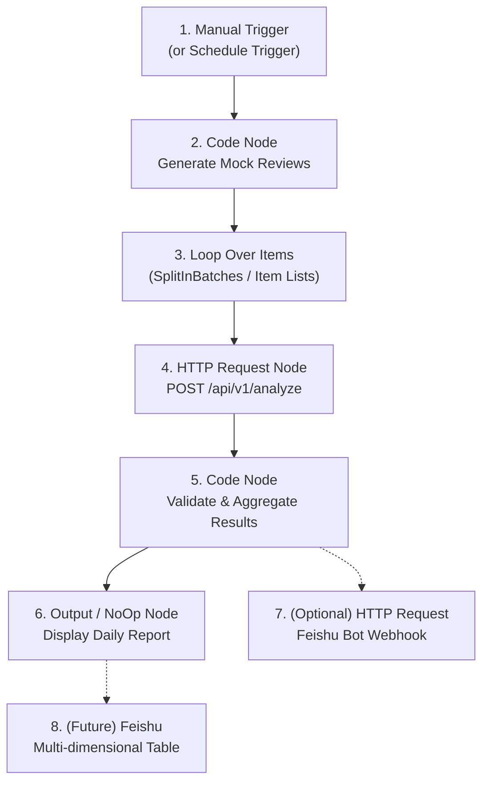
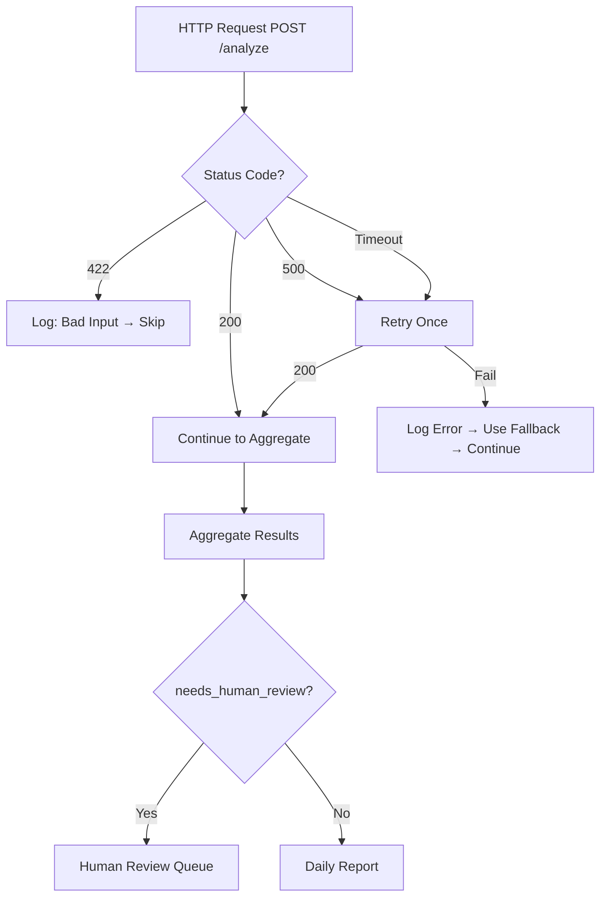

# n8n Workflow Design

> Cross-border e-commerce review monitoring and automatic classification — n8n workflow documentation.
> This document guides you through building, understanding, and demoing the n8n workflow that calls the FastAPI AI analysis service.

---

## 1. Workflow Goal

This n8n workflow automates the **cross-border e-commerce review monitoring and classification** pipeline.

### Business Objectives

| # | Objective | How |
|---|-----------|-----|
| 1 | **Auto-ingest review data** | Code Node generates mock reviews (production: read from DB / API / CSV) |
| 2 | **Call AI analysis service** | HTTP Request node → FastAPI `POST /api/v1/analyze` |
| 3 | **Get structured classification** | Sentiment, issue category, priority, responsible team, Chinese summary, suggested action |
| 4 | **Aggregate into daily report** | Code Node computes statistics, distributions, and human-review flags |
| 5 | **Notify operations team** | (Future) Feishu bot webhook, Feishu multi-dimensional table, email |
| 6 | **Extend to real platforms** | (Future) Amazon SP-API, Shopify Admin API, customer service ticketing |

### Why This Workflow Matters

- **One-click execution**: From raw review data to structured report in seconds.
- **Consistent classification**: LLM + schema validation ensures every review is classified the same way.
- **Human-in-the-loop**: Low-confidence and contradictory results are flagged, not auto-closed.
- **Interview-ready**: Demonstrates AI service integration, workflow orchestration, and production thinking.

---

## 2. Prerequisites

### 2.1 Start the FastAPI Service

The n8n workflow calls the FastAPI service. Start it **before** running the workflow:

```bash
conda activate ecommerce-agent
cd /root/autodl-tmp/ecommerce-review-agent

# Mock mode — no API key needed (recommended for demo)
LLM_MOCK_MODE=true uvicorn src.review_agent.api:app --host 0.0.0.0 --port 8000 --reload
```

### 2.2 Verify the Service is Running

```bash
# Health check
curl http://127.0.0.1:8000/api/v1/health
```

Expected response:

```json
{
  "status": "ok",
  "service": "ecommerce-review-agent"
}
```

### 2.3 Test the Analyze Endpoint

```bash
curl -X POST http://127.0.0.1:8000/api/v1/analyze \
  -H "Content-Type: application/json" \
  -d '{
    "review_id": "r001",
    "platform": "Amazon",
    "product_name": "Wireless Security Camera",
    "rating": 2,
    "review_text": "Battery drains too fast and the night vision is blurry.",
    "country": "US",
    "created_at": "2026-06-01"
  }'
```

### 2.4 n8n Environment Setup

```bash
conda activate ecommerce-agent
cd /root/autodl-tmp/ecommerce-review-agent

export N8N_USER_FOLDER=/root/autodl-tmp/ecommerce-review-agent/.n8n
export N8N_HOST=0.0.0.0
export N8N_PORT=5678
export N8N_LISTEN_ADDRESS=0.0.0.0
export N8N_PROTOCOL=http
export N8N_SECURE_COOKIE=false

n8n start
```

Then open `http://127.0.0.1:5678` in your browser.

> **Note**: n8n accesses FastAPI at `http://127.0.0.1:8000`. Both services run on the same machine for the MVP.

---

## 3. n8n Node Sequence

### 3.1 Flow Diagram (Mermaid)



### 3.2 Simplified Node List

| Order | Node Name | Node Type | Required |
|-------|-----------|-----------|----------|
| 1 | Manual Trigger | `n8n-nodes-base.manualTrigger` | ✅ |
| 2 | Generate Mock Reviews | `n8n-nodes-base.code` (JavaScript) | ✅ |
| 3 | Loop Over Items | `n8n-nodes-base.splitInBatches` | Optional* |
| 4 | Call Analyze API | `n8n-nodes-base.httpRequest` | ✅ |
| 5 | Aggregate Results | `n8n-nodes-base.code` (JavaScript) | ✅ |
| 6 | Output Report | `n8n-nodes-base.noOp` | ✅ |
| 7 | Feishu Notification | `n8n-nodes-base.httpRequest` | Optional |
| 8 | Feishu Table Write | `n8n-nodes-base.httpRequest` | Future |

> \* **Loop note**: For the MVP with 3 mock reviews, you can send all reviews in a single batch call (`POST /api/v1/analyze_batch`) and skip the Loop node. The Loop node is useful when processing reviews one-by-one (production pattern) or when the batch size is large. This document covers both approaches.

---

## 4. Each Node's Role

### 4.1 Manual Trigger

| Property | Value |
|----------|-------|
| **Node Type** | `n8n-nodes-base.manualTrigger` |
| **Input** | None (user clicks "Execute Workflow") |
| **Output** | Empty `{}` — triggers the workflow |
| **Configuration** | Default settings; no parameters needed |
| **Interview Point** | "This is where the workflow starts. In production, replace with a Schedule Trigger (e.g., every hour at HH:07) or a Webhook Trigger from an e-commerce platform." |

---

### 4.2 Code Node: Generate Mock Reviews

| Property | Value |
|----------|-------|
| **Node Type** | `n8n-nodes-base.code` |
| **Language** | JavaScript |
| **Input** | Trigger output (unused) |
| **Output** | Array of review objects matching `ReviewInput` schema |
| **Configuration** | Mode: "Run Once for All Items" |

**What it does**: Generates 3 mock e-commerce reviews covering different platforms, ratings, and issue types. In production, this node would read from a database, CSV file, or platform API.

**Interview Point**: "This node simulates data ingestion. In production, you'd replace this with an HTTP Request to Amazon SP-API or a database query. The key is that the downstream nodes don't care where the data comes from — they just expect the `ReviewInput` schema."

---

### 4.3 HTTP Request Node: Call Analyze API

| Property | Value |
|----------|-------|
| **Node Type** | `n8n-nodes-base.httpRequest` |
| **Method** | POST |
| **URL** | `http://127.0.0.1:8000/api/v1/analyze` |
| **Headers** | `Content-Type: application/json` |
| **Body** | JSON review object (from previous node) |
| **Timeout** | 30 seconds |
| **Retry** | 1 retry on failure |

**What it does**: Sends each review to the FastAPI AI analysis service and receives structured classification results.

**Interview Point**: "This is the bridge between workflow automation and AI intelligence. n8n handles the orchestration — timing, retries, error routing — while FastAPI + LLM handle the actual 'thinking'. This separation means you can swap the AI model or service without changing the workflow."

---

### 4.4 Code Node: Aggregate Results

| Property | Value |
|----------|-------|
| **Node Type** | `n8n-nodes-base.code` |
| **Language** | JavaScript |
| **Input** | Array of `ReviewAnalysis` objects from HTTP Request |
| **Output** | Aggregated statistics and daily report object |

**What it does**: Computes summary statistics from all analyzed reviews:
- Total reviews processed
- Negative review count and percentage
- High-priority review count
- Human review flag count
- Issue category distribution
- Responsible team distribution
- Generates a human-readable report summary

**Interview Point**: "This node demonstrates post-processing — turning raw AI outputs into actionable business intelligence. The statistics answer questions like 'Which product has the most battery complaints?' and 'How many reviews need human attention today?'"

---

### 4.5 NoOp / Output Node: Display Report

| Property | Value |
|----------|-------|
| **Node Type** | `n8n-nodes-base.noOp` |
| **Input** | Aggregated report object |
| **Output** | Same as input (pass-through) |

**What it does**: Serves as a terminal node where you can inspect the final output in the n8n execution view.

**Interview Point**: "In production, this would be replaced by nodes that write to Feishu multi-dimensional tables, send email digests, or create tickets in a customer service system. The NoOp is here as a checkpoint so you can verify the workflow output during the demo."

---

### 4.6 (Optional) HTTP Request: Feishu Bot Notification

| Property | Value |
|----------|-------|
| **Node Type** | `n8n-nodes-base.httpRequest` |
| **Method** | POST |
| **URL** | `YOUR_FEISHU_WEBHOOK_URL` (placeholder) |
| **Headers** | `Content-Type: application/json` |
| **Body** | Feishu message card with report summary |

**What it does**: Sends a formatted notification to a Feishu group chat with the daily report summary and urgent action items.

**Interview Point**: "This shows how AI analysis flows into team communication. When a high-priority negative review is detected, the operations team gets notified in Feishu within seconds — not hours."

---

## 5. FastAPI Call Specification

### 5.1 Endpoint

```
POST http://127.0.0.1:8000/api/v1/analyze
```

### 5.2 Request Headers

```
Content-Type: application/json
```

### 5.3 Request Body Example

```json
{
  "review_id": "r001",
  "platform": "Amazon",
  "product_name": "Wireless Security Camera",
  "rating": 2,
  "review_text": "Battery drains too fast and the night vision is blurry.",
  "country": "US",
  "created_at": "2026-06-01"
}
```

### 5.4 Response Body Example

```json
{
  "review_id": "r001",
  "sentiment": "negative",
  "issue_category": "battery",
  "priority": "high",
  "responsible_team": "product",
  "summary_zh": "用户反馈电池续航差且夜视模糊。",
  "suggested_action_zh": "建议产品团队检查该型号电池投诉率和夜视表现。",
  "confidence": 0.86,
  "needs_human_review": false
}
```

### 5.5 Batch Endpoint (Alternative)

For processing multiple reviews in a single HTTP call, use:

```
POST http://127.0.0.1:8000/api/v1/analyze_batch
```

Request body:

```json
{
  "reviews": [
    { "review_id": "r001", "platform": "Amazon", "product_name": "Camera A", "rating": 2, "review_text": "Battery drains too fast.", "country": "US", "created_at": "2026-06-01" },
    { "review_id": "r002", "platform": "Shopify", "product_name": "Camera B", "rating": 4, "review_text": "Great image quality.", "country": "DE", "created_at": "2026-06-02" }
  ]
}
```

Response includes `total`, `needs_human_review_count`, and `results[]`.

### 5.6 Response Field Reference

| Field | Type | Description |
|-------|------|-------------|
| `review_id` | string | Echoed from input |
| `sentiment` | string | `positive`, `neutral`, or `negative` |
| `issue_category` | string | One of: `logistics`, `product_quality`, `battery`, `image_quality`, `customer_service`, `price`, `description_mismatch`, `other` |
| `priority` | string | `high`, `medium`, or `low` |
| `responsible_team` | string | One of: `operations`, `product`, `supply_chain`, `customer_service`, `marketing`, `unknown` |
| `summary_zh` | string | Chinese summary of the review issue |
| `suggested_action_zh` | string | Suggested action in Chinese |
| `confidence` | float | 0.0–1.0 |
| `needs_human_review` | bool | `true` if low confidence or contradiction detected |

---

## 6. Code Node Examples

### 6.1 Code Node 1: Generate Mock Reviews

Copy this into the first n8n Code Node (JavaScript):

```javascript
// ── Generate 3 Mock E-Commerce Reviews ──────────────────────────
// In production, replace with: HTTP Request to platform API,
// database query, or file read.

const mockReviews = [
  {
    review_id: "r001",
    platform: "Amazon",
    product_name: "Wireless Security Camera",
    rating: 2,
    review_text: "Battery drains too fast and the night vision is blurry.",
    country: "US",
    created_at: "2026-06-01"
  },
  {
    review_id: "r002",
    platform: "Shopify",
    product_name: "Bluetooth Earbuds",
    rating: 1,
    review_text: "Left earbud stopped pairing after 3 days. Very disappointed.",
    country: "DE",
    created_at: "2026-06-02"
  },
  {
    review_id: "r003",
    platform: "Amazon",
    product_name: "Yoga Mat",
    rating: 5,
    review_text: "Perfect thickness, non-slip, arrived on time. Love it!",
    country: "JP",
    created_at: "2026-06-02"
  }
];

// Return as items — each item flows to the next node individually.
// For batch mode (POST /api/v1/analyze_batch), wrap in a single item:
// return [{ json: { reviews: mockReviews } }];

return mockReviews.map(review => ({ json: review }));
```

**Output format**: Each review becomes one n8n item, flowing to the HTTP Request node one at a time.

**Batch alternative** (use with `POST /api/v1/analyze_batch`):

```javascript
// Return all reviews as a single batch
return [{ json: { reviews: mockReviews } }];
```

### 6.2 Code Node 2: Aggregate Results

Copy this into the second n8n Code Node (JavaScript):

```javascript
// ── Aggregate Analysis Results ──────────────────────────────────
// Input: array of items from HTTP Request node,
// each item.json is a ReviewAnalysis object.

const results = $input.all().map(item => item.json);

// ── Counts ──────────────────────────────────────────────────────
const totalReviews = results.length;
const negativeReviews = results.filter(r => r.sentiment === 'negative').length;
const highPriorityReviews = results.filter(r => r.priority === 'high').length;
const needsHumanReviewCount = results.filter(r => r.needs_human_review === true).length;

// ── Category Distribution ───────────────────────────────────────
const categoryDistribution = {};
results.forEach(r => {
  const cat = r.issue_category || 'other';
  categoryDistribution[cat] = (categoryDistribution[cat] || 0) + 1;
});

// ── Responsible Team Distribution ───────────────────────────────
const teamDistribution = {};
results.forEach(r => {
  const team = r.responsible_team || 'unknown';
  teamDistribution[team] = (teamDistribution[team] || 0) + 1;
});

// ── High-Priority Items (for notification) ──────────────────────
const highPriorityItems = results.filter(r =>
  r.priority === 'high' || r.needs_human_review === true
);

// ── Report Summary ──────────────────────────────────────────────
const reportSummary = `
📊 Daily Review Analysis Report
━━━━━━━━━━━━━━━━━━━━━━━━━━━━
Total Reviews:        ${totalReviews}
Negative Reviews:     ${negativeReviews} (${((negativeReviews / totalReviews) * 100).toFixed(1)}%)
High Priority:        ${highPriorityReviews}
Needs Human Review:   ${needsHumanReviewCount}

📂 Category Distribution:
${Object.entries(categoryDistribution)
  .map(([k, v]) => `  - ${k}: ${v}`)
  .join('\n')}

👥 Responsible Team Distribution:
${Object.entries(teamDistribution)
  .map(([k, v]) => `  - ${k}: ${v}`)
  .join('\n')}

⚠️  Items Requiring Attention:
${highPriorityItems
  .map(r => `  - [${r.review_id}] ${r.priority} | ${r.issue_category} | ${r.summary_zh}`)
  .join('\n') || '  (none)'}
`.trim();

// ── Return aggregated object ────────────────────────────────────
return [{
  json: {
    report_generated_at: new Date().toISOString(),
    total_reviews: totalReviews,
    negative_reviews: negativeReviews,
    high_priority_reviews: highPriorityReviews,
    needs_human_review_count: needsHumanReviewCount,
    category_distribution: categoryDistribution,
    responsible_team_distribution: teamDistribution,
    high_priority_items: highPriorityItems,
    report_summary: reportSummary,
    // Keep raw results for debugging / downstream nodes
    raw_results: results
  }
}];
```

**Output**: A single item containing the full aggregated report. This item flows to the NoOp node (or Feishu notification node) for display.

### 6.3 (Optional) Code Node 3: Format Feishu Message

If using the Feishu webhook node, add this Code Node **before** the Feishu HTTP Request:

```javascript
// ── Format Feishu Bot Message Card ──────────────────────────────
const report = $input.first().json;

const highPriorityAlerts = report.high_priority_items
  .map(r => `【${r.priority.toUpperCase()}】${r.summary_zh} → ${r.suggested_action_zh}`)
  .join('\n') || '(无)';

const feishuMessage = {
  msg_type: "interactive",
  card: {
    header: {
      title: { content: "📊 每日评论分析报告", tag: "plain_text" }
    },
    elements: [
      {
        tag: "div",
        text: {
          content: `总评论数：**${report.total_reviews}**\n负面评论：**${report.negative_reviews}**\n高优先级：**${report.high_priority_reviews}**\n需人工复核：**${report.needs_human_review_count}**`,
          tag: "lark_md"
        }
      },
      {
        tag: "hr"
      },
      {
        tag: "div",
        text: {
          content: `⚠️ 需关注事项：\n${highPriorityAlerts}`,
          tag: "lark_md"
        }
      },
      {
        tag: "note",
        elements: [
          {
            content: `生成时间：${report.report_generated_at}`,
            tag: "plain_text"
          }
        ]
      }
    ]
  }
};

return [{ json: feishuMessage }];
```

---

## 7. Error Handling Strategy

A production n8n workflow must not fail silently. Here is the error handling strategy for each failure mode:

### 7.1 FastAPI Service Not Started

| Aspect | Handling |
|--------|----------|
| **Symptom** | HTTP Request node returns `ECONNREFUSED` or timeout |
| **n8n Behavior** | HTTP Request node fails; workflow stops |
| **Fix** | Start FastAPI first: `LLM_MOCK_MODE=true uvicorn src.review_agent.api:app --host 0.0.0.0 --port 8000` |
| **Production** | Add a health-check node at workflow start; if health fails, send alert and skip downstream |

### 7.2 HTTP Request Timeout

| Aspect | Handling |
|--------|----------|
| **Symptom** | LLM call takes > 30 seconds |
| **n8n Behavior** | HTTP Request node has configurable timeout (default 30s) |
| **Config** | Set timeout to 60s in HTTP Request node options; enable "Retry on Fail" (1 retry) |
| **Production** | Use exponential backoff (n8n's built-in "Retry on Fail" with wait); if still fails, log to error queue |

### 7.3 API Returns 422 (Validation Error)

| Aspect | Handling |
|--------|----------|
| **Symptom** | Request body doesn't match `ReviewInput` schema |
| **n8n Behavior** | HTTP Request node returns 422 |
| **Handling** | Add an IF node after HTTP Request: check `$json["statusCode"] !== 200` → route to error branch |
| **Error branch** | Code Node logs the bad input to a file/DB; continues processing other reviews |
| **Prevention** | Code Node 1 should validate data shape before sending |

### 7.4 API Returns 500 (Internal Server Error)

| Aspect | Handling |
|--------|----------|
| **Symptom** | FastAPI internal error (LLM failure, parsing error, etc.) |
| **n8n Behavior** | HTTP Request node returns 500 |
| **Handling** | Retry once; if still 500, log the review_id to an error list and skip |
| **Production** | The FastAPI service already has a global exception handler and safe fallback. If 500 persists, escalate to on-call. |

### 7.5 Low Confidence Result

| Aspect | Handling |
|--------|----------|
| **Symptom** | `confidence < 0.6` |
| **FastAPI Behavior** | Automatically sets `needs_human_review: true` (guardrail rule #1) |
| **n8n Behavior** | Aggregate node counts these; Feishu message highlights them |
| **Production** | Route `needs_human_review: true` items to a human review queue (e.g., Feishu multi-dimensional table with "待复核" status) |

### 7.6 needs_human_review = true

| Aspect | Handling |
|--------|----------|
| **Meaning** | Low confidence, contradiction detected, or analysis exception |
| **n8n Behavior** | Aggregated separately in report; shown in "⚠️ Items Requiring Attention" section |
| **Production** | Create ticket in customer service system; assign to duty manager |

### 7.7 Feishu Bot Webhook Failure

| Aspect | Handling |
|--------|----------|
| **Symptom** | Webhook URL unreachable or returns non-200 |
| **n8n Behavior** | HTTP Request node fails |
| **Handling** | Add an "Error Trigger" or "IF" node: if Feishu fails, write report to local file as fallback |
| **Production** | Queue messages; retry with backoff; alert if webhook is down for > 5 minutes |

### 7.8 Duplicate Execution (Idempotency)

| Aspect | Handling |
|--------|----------|
| **Problem** | Accidentally clicking "Execute Workflow" twice processes the same reviews twice |
| **MVP Mitigation** | Use `review_id` as dedup key in aggregation; the report shows per-review_id results — duplicates are visible |
| **Production** | Before sending to Feishu/DB, check if `review_id` was already processed today; skip if yes |

### 7.9 Error Routing Diagram



### 7.10 Production Principles

1. **Never fail silently**: Every error path produces a log entry or notification.
2. **Retry with backoff**: Transient failures (network, timeout) are retried; permanent failures (422) are not.
3. **Human-in-the-loop**: Uncertain results are flagged, not auto-resolved.
4. **Idempotency**: Duplicate processing is detected and doesn't create duplicate notifications.
5. **Graceful degradation**: If Feishu is down, the report is still saved locally.
6. **Observability**: Error counts, retry counts, and processing latency are tracked.

---

## 8. Interview Talking Points (2-Minute Script)

> Use this script to explain the n8n workflow in an interview.

---

"这个 n8n 工作流展示了**如何把 AI 分析能力接入业务自动化流程**。"

"整个架构分三层：**n8n 负责编排**——什么时候触发、数据怎么流转、异常怎么处理；**FastAPI 是 AI 分析服务**——接收评论数据、调用 DeepSeek LLM、返回结构化分类结果；**LLM 在 HTTP Request 节点背后发挥智能判断**——它理解评论内容、判断情绪、分类问题、生成中文摘要和建议动作。"

"为什么第一版用**固定 Workflow 而不是完全自主 Agent**？因为评论分类是一个**标准化、可重复、高频率**的任务。Workflow 的输出是可预期的、可审计的、可监控的。Agent 更灵活，但适合不确定性更高的场景——比如多步推理、工具调用。在评论分类这个场景，Workflow + LLM 的组合在成本、稳定性、可控性之间达到了最好的平衡。"

"为什么选 **n8n**？三个原因：第一，自托管，数据不出公司内网；第二，Code Node 允许写 JavaScript，灵活性远超无代码平台；第三，原生支持 HTTP Request、Webhook、定时触发，跟 FastAPI、飞书的集成非常自然。"

"**如何扩展到飞书多维表格和业务系统**？在 n8n 里加一个 HTTP Request 节点调用飞书 Base API，把分类结果写入表格——review_id、问题分类、优先级、责任人、复核状态一目了然。后续再加一个飞书机器人节点，高优先级评论自动推送到运营群。"

"**如何保证输出稳定和可人工复核**？三层保障：第一，LLM 的 Prompt 严格要求 JSON 输出 + Few-shot 示例；第二，Pydantic Schema 验证——字段对不上就重试，重试失败就用安全兜底；第三，低置信度、矛盾结果自动标记 `needs_human_review: true`——人不复核，这条评论不会自动关闭。"

"这就是一个**从业务问题出发，用 AI + 工程化手段落地**的完整闭环。"

---

## 9. Future Extensions

### Phase 1: Notification & Collaboration (Next)

| Extension | Description | n8n Nodes |
|-----------|-------------|-----------|
| Feishu Bot Webhook | Send daily report + urgent alerts to group chat | HTTP Request → Feishu webhook URL |
| Feishu Multi-dimensional Table | Write classified reviews to Feishu Base for team collaboration | HTTP Request → Feishu Base API |
| Human Review Status Flow | Track review status: 待复核 → 已确认 → 已处理 → 已关闭 | Feishu Table + Webhook callback |

### Phase 2: Real Platform Integration

| Extension | Description | n8n Nodes |
|-----------|-------------|-----------|
| Amazon SP-API | Fetch real reviews from Amazon Seller Central | HTTP Request (OAuth) → Amazon SP-API |
| Shopify Admin API | Fetch real reviews from Shopify store | HTTP Request → Shopify GraphQL |
| Multi-platform Aggregation | Combine reviews from Amazon + Shopify + AliExpress | Merge node → Batch analyze |

### Phase 3: Intelligence Upgrade

| Extension | Description | n8n Nodes |
|-----------|-------------|-----------|
| RAG Knowledge Base | Match reviews against customer service SOP for suggested actions | HTTP Request → RAG service |
| Scheduled Daily Report | Auto-run at 9:07 AM daily | Schedule Trigger (Cron) |
| Trend Detection | Compare today's report with yesterday's; alert on spikes | Code Node (diff logic) |

### Phase 4: Operations Dashboard

| Extension | Description |
|-----------|-------------|
| Data Dashboard | Grafana / Metabase dashboard showing review trends, category distribution, team workload |
| SLA Monitoring | Alert if high-priority review is not reviewed within 2 hours |
| Auto-reply (Low Risk) | For simple, high-confidence positive reviews, auto-reply with thank-you template |

---

## Appendix: Importing the Workflow Template

A best-effort workflow JSON template is provided at:

```
n8n/review_workflow_template.json
```

**To import**:

1. Open n8n (`http://127.0.0.1:5678`)
2. Click "Import from File" (or drag-and-drop the JSON file)
3. If import fails due to version mismatch, create the workflow manually following the node sequence in Section 3 of this document.

**Template compatibility note**: The JSON template targets n8n v1.x format. If you're using a different version, some node parameters may differ. The template is a **reference** — the authoritative specification is this document.

**No secrets in the template**: All URLs, API keys, and webhook tokens use placeholder values (e.g., `YOUR_FEISHU_WEBHOOK_URL`). Replace these with your actual values before execution.

---

*(End of n8n workflow design document.)*
